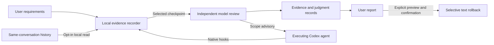

<div align="center">

# Navi

### Scope awareness for long-running coding agents.

An independent reviewer that remembers task boundaries, checks observed work,
and sends advisory feedback to the agent doing the work.

[](https://github.com/davinh47/Navi/actions/workflows/tests.yml)
[](LICENSE)
[](docs/LIMITATIONS.md)
[](CONTRIBUTING.md)

[Quick start](#quick-start) · [How it works](#how-it-works) · [Architecture](docs/ARCHITECTURE.md) · [中文](README.zh-CN.md)

</div>

---

You ask for a UI change. Half an hour later, the agent is wiring a backend you wanted to defer.
Or a small bug fix grows into a refactor. Or “continue” loses its connection to the agreed plan.

**Navi adds a separate perspective at selected checkpoints.** It compares user requirements with
bounded tool and file evidence, records its judgment, and can remind the executing agent to recheck
scope. The agent can accept or dispute the reminder and continue working. You get the final report.

Navi installs as a Codex plugin. **It never denies tool execution, forces another turn, or automatically rolls back work.**

> **Experimental alpha.** Codex on macOS is the tested target; Claude Code and other adapters are
> future work. Detection accuracy and net token savings have not been established. Independent reviews
> consume your Codex usage, and false positives, missed drift, and failed reviews are possible.

## What it watches

| Situation | Current behavior |
| --- | --- |
| An unrelated investigation replaces the assigned work | Scope review can flag observed tool activity and send an advisory |
| A task expands into a deferred phase, integration, or refactor | Compares the change with user scope and later amendments |
| Required capabilities are dropped, substituted, or falsely reported complete | Reviews observed delivery mismatches, advises the agent, and highlights findings and uncertainty in the report |
| A mid-task clarification displaces the original goal | Preserves ordered user sources and supporting conversation context |
| An explanation becomes unrequested UI copy | Evaluates whether presentation was actually requested |
| Excessive fallbacks or case-specific patches | Separate implementation-risk assessment; **record-only** in this version |
| Unwanted changes need inspection | Evidence reports and explicit, user-confirmed selective text rollback |

These are detection targets, not guaranteed capabilities. See [coverage and limitations](docs/LIMITATIONS.md).

## How it works



1. **Capture scope.** Opt in a workspace and task. Preserve user messages as authority; keep agent
   plans, interpretations, and reported progress separate.
2. **Observe bounded evidence.** Watch selected files and, when enabled, local tool activity.
   Existing conversations can import history, then incrementally read new messages without another
   history-summary model call.
3. **Review asynchronously.** A separate, tool-disabled `codex exec` process evaluates scope and
   implementation risk. It uses your existing Codex login and the configured model; Navi does not
   copy credentials or require a separate API key for the tested login-based workflow.
4. **Advise and report.** Eligible scope findings reach the executing agent through a hook.
   Stale findings, incomplete evidence, responses, and known usage remain visible in the report.

The reviewer is independent from the executing model, but its verdict is still fallible. User
requirements remain authoritative. An agent response is supporting evidence, not new permission.

## Quick start

### Requirements

- **macOS**, Python **3.9+**, Git, and a Codex installation with plugins and hooks.
- `codex` and `python3` available on the hook process's `PATH`.
- Your own Codex login and access to the selected review model.
- No pip or npm dependencies for Navi itself.

The development host used `codex-cli 0.154.0-alpha.6.2`. Host APIs may change; see
[installation and compatibility](docs/INSTALL.md).

### Install from this repository

```sh
codex plugin marketplace add https://github.com/davinh47/Navi.git
codex plugin add navi@navi
```

Open the plugin/hook settings, review and enable Navi's hooks, and start a new session so the plugin
is loaded. Installing alone does **not** enable content capture or independent reviews for every task.
Avoid enabling two copies of Navi from different marketplaces at once.

### Enable supervision for a task

In your project conversation, add Navi before your task description:

> Use Navi to supervise this task.
>
> [Your task description]

For a longer task, say “Use Navi's long-task mode to supervise this task.” To include earlier context,
add “Use the history of this conversation.” You do not need to repeat the setup when continuing the same task.

Codex sets up supervision and confirms its status. On first activation, you may need to send your task
in a follow-up message before monitoring can begin. Scope reminders go to Codex; reports go to you.
See [usage and troubleshooting](docs/USAGE.md).

## Budgets and cost

| Profile | Minimum automatic dispatch interval | Rolling hourly review / dispatch limits | Reminder cooldown |
| --- | ---: | ---: | ---: |
| Standard | 30 seconds | 6 reviews, 6 dispatches | 1 minute |
| Long-task | 5 minutes | 4 reviews, 4 dispatches | 5 minutes |

**There is no default cumulative review, dispatch, or reminder quota.** Reviews require new eligible
evidence; an interval is a rate limit, not a periodic schedule or guaranteed monitoring duration.
Hourly capacity returns as the window clears, with work resuming at the next eligible native event.
Manual and automatic reviews, including followups and failed reservations, share the hourly review
limit. Automatic dispatch attempts have a separate hourly limit, including failed launches.

You can optionally set a cumulative review ceiling for a conversation. Already-used reservations count
toward it; changing profiles, restarting, or continuing never clears usage. Reaching that ceiling pauses
new evaluations and is shown in the report. Existing valid advisories may still be delivered. No review
slot is withheld for a hypothetical followup. See [budget controls](docs/USAGE.md#review-budgets).

Reminders use deduplication, cooldown and expiry rather than a lifetime count. Only the most recent
16 review details and 48 reminder details are retained; reports disclose omitted detail and preserve
cumulative counts and available token totals. Independent reviews still have bounded evidence coverage.

The initial optional history interpretation has a separate **one-call** budget. Default models are
`gpt-5.6-luna` / **high** for supervision and **medium** for history interpretation; these are configurable
and depend on account availability. Test harnesses use explicit low-effort settings where documented.

Local recording, incremental parsing, and report generation do not call a model. **Each independent
review still receives a bounded context packet**; incremental parsing does not imply incremental model
billing. Reducing repeated input and improving long-conversation budgets are open engineering tasks.

## Project status

- **303 offline tests** cover state, scheduling, evidence, reminders, reports, rollback and package relocation.
- The repository includes authored replay fixtures and offline tests; live-model evaluations are optional.
- See the validation guide for reproducible checks and the limits of this evidence.
- No claimed benchmark leadership, calibrated detection accuracy, or demonstrated net usage savings.

Read [validation and evidence boundaries](docs/VALIDATION.md) for what these checks do—and do not—prove.

## Development

```sh
git clone https://github.com/davinh47/Navi.git
cd Navi
python3 -m unittest discover -s tests -v
```

Offline tests use temporary fixtures and mocked model calls. They require no model login or paid calls.
Live evaluations are explicit opt-in and may consume usage; see [contributing](CONTRIBUTING.md).

```text
plugins/navi/       Installable Codex plugin: hooks, skill, Python runtime
.agents/plugins/   Repository marketplace catalog
tests/             Offline behavioral and integration tests
evals/             Authored scope and implementation-risk fixtures
tools/             Evaluation and packaging utilities
docs/              Installation, architecture, privacy, and limitations
```

## Roadmap

- Lower repeated-context cost and improve cache reuse.
- Improve malformed citation handling without accepting invented evidence.
- Evaluate rate defaults and optional token-based budgets on realistic long tasks.
- Evaluate natural long-task drift, false alarms, adoption, and end-to-end cost on diverse projects.
- Add adapters for other coding agents after the Codex integration is better established.

## Privacy and license

Opted-in evidence can contain user requests, code, paths, and tool outputs. Local storage is not the
same as local-only inference: enabling an independent review sends its evidence packet through Codex
to the configured model service. See [privacy](docs/PRIVACY.md) and [security reporting](SECURITY.md).

[MIT](LICENSE) © 2026 davinh47. Codex is an OpenAI product; Navi is an independent community project.
