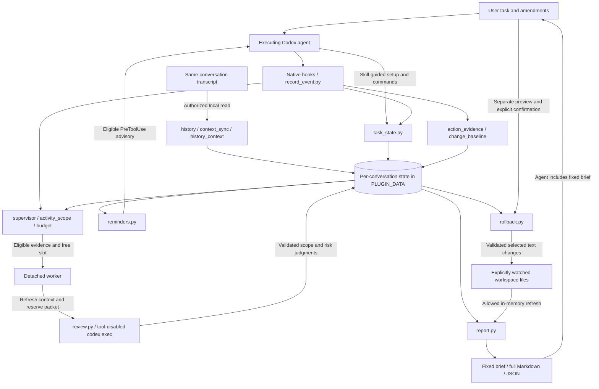

# Architecture

Navi keeps observation, interpretation, judgment, and execution authority separate.
The current adapter uses Codex native hooks. The evaluator is a separate tool-disabled process;
the main agent continues while the evaluator runs.

| Component | Responsibility |
| --- | --- |
| `record_event.py` | Normalize supported hooks; record bounded metadata; dispatch local handlers |
| `task_state.py` | Opt-in user sources, cited intent proposals, per-conversation state and budgets |
| `history.py` / `context_sync.py` | Read canonical same-session text; verify source identity and incrementally parse additions |
| `history_context.py` | Join imported/live sources; bounded assistant context; optional one-call history interpretation |
| `action_evidence.py` / `change_baseline.py` | Bounded tool observations, explicit file snapshots and change provenance |
| `supervisor.py` / `activity_scope.py` | Select evidence checkpoints, enforce spacing/shared concurrency, and schedule independent evaluation |
| `review.py` | Isolated `codex exec`, structured scope/risk output, source/action citation validation |
| `reminders.py` | Non-blocking advisory delivery, expiry, deduplication and optional agent responses |
| `report.py` / `rollback.py` | Deterministic reports; separately confirmed selective text rollback |

## Runtime flow

The durable task record contains authority, bounded observations, review jobs, reminder records and
usage rollups. Locks protect concurrent access. A detached worker owns temporary model input/output;
report-time file refresh stays in memory. The main agent's own task execution is outside Navi's control.

## First activation

The skill treats supervision of the current task as including its same-conversation requirements,
subject to explicit user restrictions. `history.bootstrap` creates a pending shell with no user sources
and no established contract, or preserves an existing task's state while requesting its first history read.
A root native hook supplies the actual workspace, turn and transcript. `history.worker` verifies a canonical
user message at that boundary, then `history_context.assemble` integrates ordered raw sources directly.
The anchor stays separate from live submissions, including during incremental synchronization. No history
model call is needed. Until validated context is ready, reviews stay unavailable. `reminders.on_hook` can
bind the initial active turn from a real root tool event, so missing the first UserPromptSubmit does not
prevent first-turn advisory delivery. No synthetic user event or rollback consent is created.

## Authority and evidence

Ordered direct user messages establish scope. Later explicit amendments can supersede earlier
requirements; unaffected constraints remain. Agent proposals help resolve references only when the
user actually approves the relevant work. Repository text, tool output, compaction summaries, and
agent statements do not become user authorization.

Imported sources retain provenance and cannot become fresh rollback consent. User-source versions
and assistant-support versions are tracked separately: a new progress note must not detach existing
observations from the user requirements that applied when they were recorded.

The reader checks transcript identity, canonical event types, supported compaction continuity and
file-prefix consistency. It parses new records from a persisted cursor, but still reads old bytes
locally for integrity hashing. It is not a generic parser for every past/future Codex transcript format.

## Scheduling and delivery

The hook path does not wait for a model. A detached worker coalesces activity, refreshes context,
reserves an evidence-bounded call, and saves the result. Local scripts use file locking for shared state.
Late, outdated, incomplete, or failed findings cannot silently become successful checks.

Scope and implementation risk share one model request but have independent verdicts and citations.
A scope advisory is emitted at an eligible `PreToolUse` boundary; it is not a tool permission decision.
A stopped turn does not trigger a new turn for delivery. The agent can evaluate or dispute the advice.

Automatic dispatch requires new eligible evidence, a minimum interval (standard 30 seconds, long-task
180 seconds), and a free per-conversation slot. Manual reviews share the slot and optional cumulative
ceiling but not automatic spacing. There are no hourly caps or default cumulative quotas. A pending
automatic worker also occupies the slot before reserving a model call. No polling daemon guarantees a
review immediately when the interval expires; another eligible event is required.

## Reporting boundary

`report.generate` builds a snapshot, adds `supervisor.runtime_status`, and renders `brief` into
`user_summary`. The CLI exposes that same text through `--format brief`; full Markdown remains the
default. The skill requires the executing agent to paste the brief verbatim, but cannot enforce the
host's final response. Reporting never launches a model. Ordinary reports do not wait; `--final` waits up to 15 seconds for
existing reviews/dispatches with the lock released between polls, then refreshes and renders the snapshot.
It does not follow unrelated new calls, reset the deadline, or equate a returned result with current coverage.

Current readiness, result freshness, bounded evidence coverage and reminder delivery are separate
facts. Cumulative reservations/usage are distinct from the retained 16 review and 48 reminder details.
Delivery-gap findings share the ordinary reviewer path; there is no mandatory final audit. See the
[report guide](REPORTING.md) for fields and their limits.

## Limits and future adapters

The plugin currently contains Codex-specific protocol handling rather than a finished multi-agent
adapter framework. The portable concepts are user authority, observed actions, review packets,
advisory responses and reports. A future adapter must establish its own native provenance and delivery
semantics rather than treating plain text as trusted user input.

[Limits](LIMITATIONS.md) · [Privacy](PRIVACY.md) · [Validation](VALIDATION.md)
